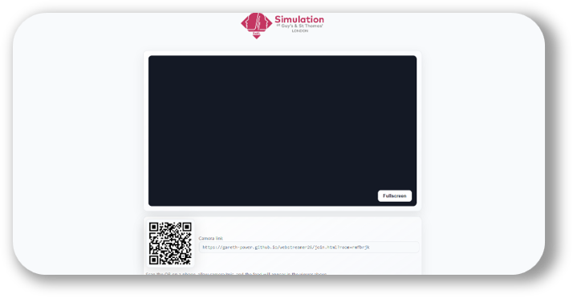

	

# WebStreamer

A lightweight, no-install camera streaming tool for simulation and training environments. Built for the Simulation and Interactive Learning (SaIL) team at Guy's & St Thomas' NHS Foundation Trust.

Powered by [VDO.Ninja](https://vdo.ninja) — peer-to-peer WebRTC streaming, no server required.

---

## Live app

**[https://gpowe.github.io/webstreamer26/](https://gpowe.github.io/webstreamer26/)**

---

## How it works

The app has two pages:

### Viewer (`index.html`)
Open this on the display screen or facilitator's computer. It:
- Generates a unique room code and stores it in the URL (so refreshing keeps the same room)
- Embeds a live video viewer that shows all camera feeds from the room
- Displays a QR code and shortened link that camera operators can scan to join

### Camera join (`join.html`)
Opened by scanning the QR code on a phone or tablet. It:
- Loads VDO.Ninja in full-screen, ready to publish the device's camera
- Defaults to the rear-facing camera at 30fps
- Hides the viewer feed so camera operators only see their own output

All video travels directly between devices (peer-to-peer). Nothing is recorded or stored.

---

## Usage

1. Open the viewer page on the display screen
2. A QR code appears automatically — share it with anyone who needs to send a camera feed
3. They scan it on their phone, allow camera and microphone access, and their feed appears in the viewer within a few seconds
4. Use the **Fullscreen** button to expand the viewer

To reuse the same room (e.g. across a session), copy the URL after the room code has been set — it will contain a `?room=` parameter. Share that URL directly rather than the base URL to always land in the same room.

---

## Audio settings

The sender is configured for ambient room capture rather than voice calls:

| Setting | Value | Reason |
|--------|-------|--------|
| Sample rate | 48 kHz stereo | Broadcast quality |
| Codec | VP8 | Broad browser compatibility |
| Echo cancellation | Off | Preserves natural room sound |
| Noise suppression | Off | Avoids filtering out simulation audio |
| AGC | On | Handles level variation across devices |

If volume is consistently low, the `gain` parameter in `join.html` can be increased (e.g. `&gain=2`).

---

## Deployment

This is a static site — no build step or server needed. It runs directly from GitHub Pages.

To deploy your own copy:
1. Fork this repository
2. Go to **Settings → Pages** and set the source to the `main` branch, root folder
3. Your viewer will be live at `https://<your-username>.github.io/<repo-name>/`

---

## Dependencies

| Service | Purpose |
|---------|---------|
| [VDO.Ninja](https://vdo.ninja) | WebRTC peer-to-peer streaming |
| [api.qrserver.com](https://api.qrserver.com) | QR code generation |
| [is.gd](https://is.gd) | URL shortening (falls back gracefully if unavailable) |

All dependencies are external free services — nothing is self-hosted.
